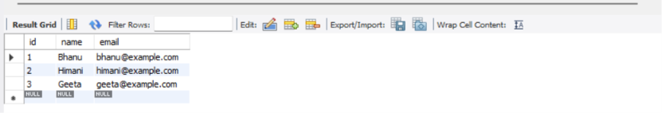
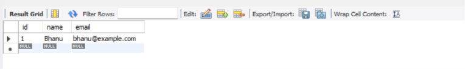
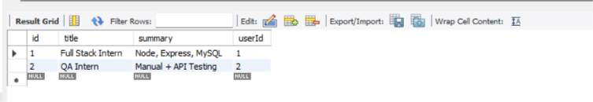

# Resume Database Management System

## About The Project

This project is a simple **Resume Database Management System** created using **MySQL**.

The purpose of this project is to understand relational database concepts by creating tables, storing data, retrieving records, and establishing relationships between multiple tables using SQL.

The project demonstrates database creation, table creation, data insertion, filtering records, and combining data using SQL JOIN operations.

---

## Technologies Used

- MySQL
- SQL

---

## Database Information

**Database Name:**

```
resume_db
```

The database contains two tables:

- Users
- Resumes

---

# Database Structure

## Users Table

The `users` table stores information about users.

| Column | Data Type | Description |
|--------|-----------|-------------|
| id | INT | Unique user ID (Primary Key) |
| name | VARCHAR(255) | User name |
| email | VARCHAR(255) | User email (Unique) |

---

## Resumes Table

The `resumes` table stores resume details linked with users.

| Column | Data Type | Description |
|--------|-----------|-------------|
| id | INT | Unique resume ID (Primary Key) |
| title | VARCHAR(255) | Resume title |
| summary | TEXT | Resume summary |
| userId | INT | Foreign Key referencing users table |

---

# SQL Implementation

## Creating Database

```sql
CREATE DATABASE resume_db;

USE resume_db;
```

---

## Creating Users Table

```sql
CREATE TABLE users (
    id INT AUTO_INCREMENT PRIMARY KEY,
    name VARCHAR(255) NOT NULL,
    email VARCHAR(255) NOT NULL UNIQUE
);
```

---

## Inserting User Data

```sql
INSERT INTO users (name, email)
VALUES
('Tushar', 'tushar@example.com'),
('Himani', 'himani@example.com'),
('Meera', 'meera@example.com');
```

---

## Creating Resumes Table

```sql
CREATE TABLE resumes (
    id INT AUTO_INCREMENT PRIMARY KEY,
    title VARCHAR(255) NOT NULL,
    summary TEXT,
    userId INT,
    FOREIGN KEY (userId) REFERENCES users(id)
);
```

---

## Inserting Resume Data

```sql
INSERT INTO resumes (title, summary, userId)
VALUES
('Full Stack Intern', 'Node, Express, MySQL', 1),
('QA Intern', 'Manual + API Testing', 2);
```

---

# SQL Queries and Output

## 1. Display All Users

### Query

```sql
SELECT * FROM users;
```

### Output



---

## 2. Search User By Email

### Query

```sql
SELECT * FROM users
WHERE email = 'bhanu@example.com';
```

### Output



---

## 3. Display All Resumes

### Query

```sql
SELECT * FROM resumes;
```

### Output



---

## 4. Display Resume Details With User Name

### Query

```sql
SELECT resumes.title, users.name
FROM resumes
JOIN users
ON resumes.userId = users.id;
```

### Output


---

# Project Structure

```
Resume-Database-Management-System
│
├── resume.sql
│
└── screenshots
    ├── image1.png
    ├── image2.png
    ├── image3.png
    └── image4.png
```

---

# How To Run The Project

1. Install MySQL on your system.

2. Open MySQL Workbench or MySQL Command Line.

3. Open the SQL file.

```
resume.sql
```

4. Execute all SQL queries.

5. View the database tables and query outputs.

---

# Concepts Learned

- Database creation using SQL
- Creating relational tables
- Primary Key and Foreign Key concepts
- Data insertion and retrieval
- Filtering records using WHERE clause
- Understanding table relationships
- Performing JOIN operations
- Working with relational databases

---

# Author

**Tushar Bisht**
